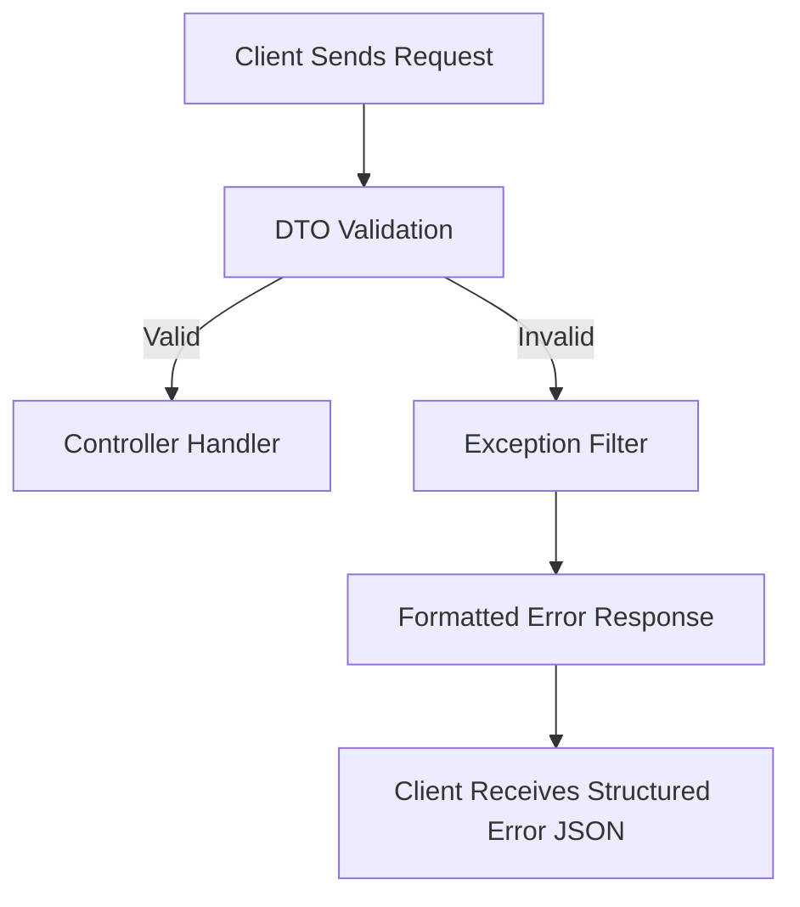
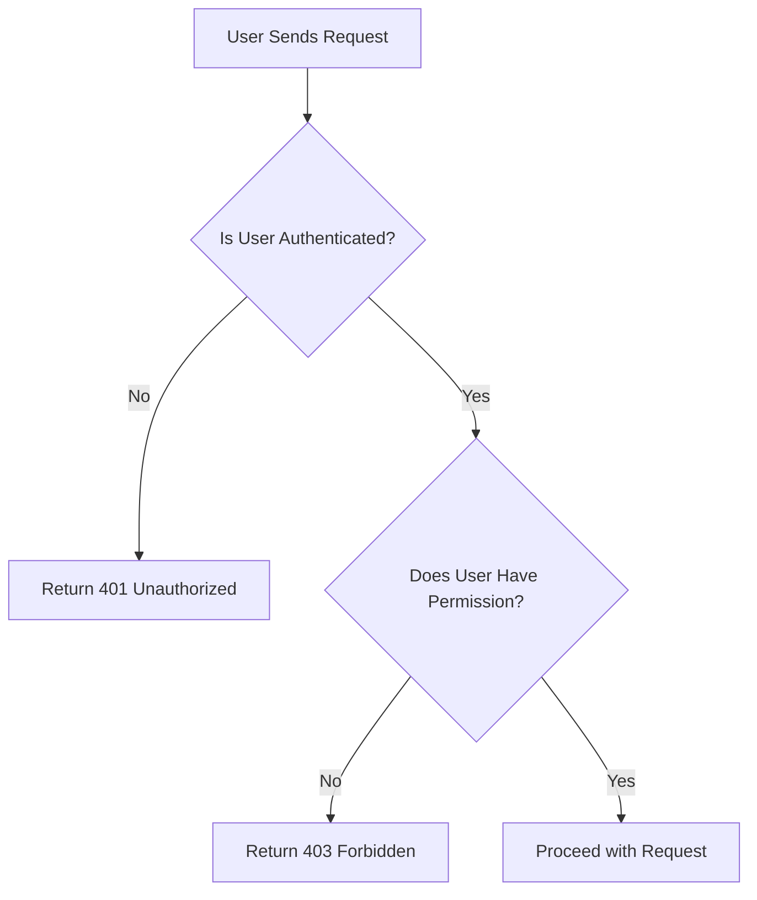

# 📚 API Error Reference

This comprehensive guide documents all error responses from our backend API. It provides frontend developers with clear
patterns for implementing consistent error handling and user feedback.


## 🔖 Response Structure

The following table describes the standard fields in all error responses:

| Field        | type   | Description                                                  |
|--------------|--------|--------------------------------------------------------------|
| `statusCode` | number | HTTP status code of the response                             |
| `error`      | string | Short  , standardized  (e.g., `Bad Request`, `Unauthorized`) |
| `message`    | string | Human-readable error description                             | 
| `timestamp`  | string | ISO 8601 timestamp when the error occurred                   | 
| `path`       | string | API endpoint path that generated the error                   |
| `field`      | string | Field name as received in the request                        |
| `type`       | Enum   | Machine-readable error identifier (e.g., `validation.error`) |
| `errors[]`   | array  | Optional array of field-specific error details               |
| `meta`       | object | Optional context-specific metadata about the error           |

## 🎯 Field-Specific Error Format

When individual fields have errors, they appear in the error array with this structure:

#### Example: {id="example_1"}

```json 
{
  "field": "fieldName",
  "message": "Field-specific error message"
}
```

## 📦 Example Basic Error Response

#### Example: {id="example_2"}

```json
{
  "statusCode": 400,
  "error": "Bad Request",
  "message": "Invalid request data",
  "timestamp": "2025-04-24T13:51:19.608Z",
  "path": "/api/v1/orders",
  "type": "validation.error",
  "errors": [
    {
      "field": "deliveryAddress",
      "message": "deliveryAddress must be shorter than or equal to 255 characters"
    }
  ]
}
```

## 🗂️ Error Type Classification

Our API errors are organized into these logical categories:

| Category            | Prefix      | Description                             | Common Status Codes  |
|---------------------|-------------|-----------------------------------------|----------------------|
| `Validation`        | validation. | Client-side data validation failures    | 400                  |
| `Authentication`    | auth.       | Authentication and authorization issues | 401 ,403             |
| `Database`          | db.         | Database-related errors                 | 400 ,404 , 409 , 500 |
| `File Upload`       | file.       | Problems with uploaded files            | 400 , 413            |
| `External Services` | external.   | Errors from third-party services        | 408,502,503,504      |
| `Input`             | input.      | Input formatting and structure issues   | 400                  |
| `Internal`          | internal.   | Unhandled server exceptions             | 500                  |
| `Rate Limiting`     | rate.       | API usage throttling                    | 429                  |

## ⚙️ Request Processing Flow



## ✅ Validation Errors

It Occurs when the request payload fails validation rules.

---

### Validation Multiple Fields

This error occurs when multiple fields in the requested payload fail validation rules simultaneously. It's typically
returned by class-validator in DTOs with decorated constraints (e.g., `@IsString()`, `@MaxLength()`, etc.).

This kind of error groups all the field-specific validation failures into a single response, allowing the frontend to
show all issues to the user at once.

#### Example: {id="example_3"}

```json
{
  "statusCode": 400,
  "error": "Bad Request",
  "message": "Validation failed",
  "timestamp": "2025-04-24T13:51:19.608Z",
  "path": "/api/v1/orders",
  "type": "validation.error",
  "errors": [
    {
      "field": "deliveryAddress",
      "message": "deliveryAddress must be shorter than or equal to 255 characters"
    },
    {
      "field": "cartItemsIds|orderItems",
      "message": "You must provide at least one of cartItemsIds or orderItems."
    }
  ]
}
```

## 🛡️ Authentication & Authorization Errors

This section describes the set of error types returned by the server when there is a
problem with authentication (missing or invalid credentials)
or authorization (insufficient permissions).

---

### Authentication & Authorization Errors types

| Error Type          | Description                                                |
|---------------------|------------------------------------------------------------|
| `file.invalid_type` | The provided file type is invalid.                         |
| `file.too_large`    | The provided file size exceeds the allowed limit.          |
| `file.missing`      | The provided file is missing.                              |
| `file.too_few`      | The provided file count is less than the expected minimum. |
| `file.too_many`     | The provided file count is more than the expected maximum. |

### 🛡️ Unauthorized Access (401)

This error occurs when a request is made to a protected resource without providing valid authentication credentials.
It corresponds to the HTTP 401 Unauthorized status.

#### Example: {id="example_4"}

```json
{
  "statusCode": 401,
  "error": "Unauthorized",
  "message": "Unauthorized",
  "timestamp": "2025-04-24T16:12:38.537Z",
  "path": "/api/v1/users/test",
  "type": "auth.unauthorized"
}
```

### 🚫 Forbidden Access (403)

This error is returned when a user is authenticated but does not have the necessary permissions to perform the requested
action.
It corresponds to the HTTP 403 Forbidden status.

#### Example: {id="example_5"}

```json
{
  "statusCode": 403,
  "error": "Forbidden",
  "message": "You do not have permission to create this user",
  "timestamp": "2025-04-24T14:54:38.792Z",
  "path": "/api/v1/users/test",
  "type": "auth.forbidden",
  "errors": [
    {
      "field": "_global",
      "message": "You do not have permission to create this user"
    }
  ]
}
```

### 📉 Authentication & Authorization Flow



## 📂 File Upload Errors

File upload errors are used to enforce constraints on file uploads.
They are typically returned with a 400 Bad Request HTTP status and are
useful for informing the user about the constraint violation.

---

### File Upload Error Types

| Error Type          | Description                                                |
|---------------------|------------------------------------------------------------|
| `file.invalid_type` | The provided file type is invalid.                         |
| `file.too_large`    | The provided file size exceeds the allowed limit.          |
| `file.missing`      | The provided file is missing.                              |
| `file.too_few`      | The provided file count is less than the expected minimum. |
| `file.too_many`     | The provided file count is more than the expected maximum. |

### Meta Information Explanation

The `meta` object provides additional details about the error, including the expected number of files, received file
count, the entity path, and more details.

| Field           | Explanation                                                           |
|-----------------|-----------------------------------------------------------------------|
| `fileType`      | The expected type of the file (e.g., image).                          |
| `entityPath`    | The path to the specific entity in the request (e.g., `[brands][0]`). |
| `minCount`      | The minimum allowed number of files for the entity (e.g., 1).         |
| `maxCount`      | The maximum allowed number of files for the entity (e.g., 1).         |
| `receivedCount` | The number of files actually received for the entity (e.g., 2).       |
| `receivedType`  | The MIME type of the received file (e.g., image/png).                 |
| `receivedSize`  | The size of the received file in bytes (e.g., 25.3 kB).               |
| `allowedTypes`  | The allowed file types for the entity (e.g., image/png).              |

### File Upload Too Few

This error occurs when the number of uploaded files is below the required minimum threshold. It is commonly returned
when file upload validation logic enforces a minimum number of files. The error includes a `meta` object with details
about the expected and received file counts.

#### Example: {id="example_6"}

```json
{
  "statusCode": 400,
  "error": "Bad Request",
  "message": "Minimum 1 file(s) required, but only 0 provided.",
  "timestamp": "2025-04-24T14:58:31.639Z",
  "path": "/api/v1/brands",
  "type": "file.too_few",
  "meta": {
    "minCount": 1,
    "receivedCount": 0
  }
}
```

### File Upload Too Many

This error is triggered when the number of uploaded files exceeds the maximum limit defined for a specific field. It
helps enforce constraints like "only one image allowed per resource." The response includes a meta object detailing both
the maximum allowed and the actual number of files received.

#### Example: {id="example_7"}

```json
{
  "statusCode": 400,
  "error": "Bad Request",
  "message": "Maximum 1 file(s) allowed for image, but 2 provided.",
  "timestamp": "2025-04-24T14:59:52.887Z",
  "path": "/api/v1/brands",
  "type": "file.too_many",
  "meta": {
    "maxCount": 1,
    "receivedCount": 2
  }
}
```

### File Upload Invalid Type

This error occurs when the uploaded file's MIME type does not match the accepted types for a specific field. It's useful
for enforcing file type restrictions like only allowing images or documents. The meta object provides the actual MIME
type received, which can help in debugging or displaying tailored UI feedback.

#### Example: {id="example_8"}
```json
{
  "statusCode": 400,
  "error": "Bad Request",
  "message": "Invalid file type: expected image/png, but received image/jpeg.",
  "timestamp": "2025-04-24T15:00:00.000Z",
  "path": "/api/v1/brands",
  "type": "file.invalid_type",
  "meta": {
    "receivedType": "image/jpeg"
  }
}
```

### File Upload is Too Large

This error is returned when an uploaded file exceeds the maximum allowed file size for a specific upload field. It helps
enforce backend limits for file handling and protects against large, potentially harmful uploads.

#### Example: {id="example_9"}

```json
{
  "statusCode": 400,
  "error": "Bad Request",
  "message": "File img.jpg exceeds max size of 100 B (received: 25.3 kB)",
  "timestamp": "2025-04-24T15:02:49.407Z",
  "path": "/api/v1/brands",
  "type": "file.too_large",
  "meta": {
    "fileName": "img.jpg",
    "maxSize": "100 B",
    "receivedSize": "25.3 kB"
  }
}
```

### Bulk Upload Too Few

This error occurs during bulk operations (e.g., syncing or batch creation) when a required file is missing for a
specific
entity in the payload array. The error helps identify exactly which item in the array is invalid.

#### Example: {id="example_10"}

```json
{
  "statusCode": 400,
  "error": "Bad Request",
  "message": "image is required for [brands][0]",
  "timestamp": "2025-04-24T15:07:59.543Z",
  "path": "/api/v1/brands/sync/bulk",
  "type": "file.too_few",
  "meta": {
    "fileType": "image",
    "entityPath": "[brands][0]"
  }
}

```

### Bulk Upload Invalid Type

This error occurs when a file in a bulk operation has an invalid MIME type. It's useful for identifying incorrect file
uploads tied to a specific item in a data array.

#### Example: {id="example_11"}

```json
{
  "statusCode": 400,
  "error": "Bad Request",
  "message": "image in [brands][0]: Invalid file type application/pdf.",
  "timestamp": "2025-04-24T15:13:30.091Z",
  "path": "/api/v1/brands/sync/bulk",
  "type": "file.invalid_type",
  "meta": {
    "fileType": "image",
    "entityPath": "[brands][0]",
    "receivedType": "application/pdf",
    "allowedTypes": [
      "image/png",
      "image/jpg"
    ]
  }
}
``` 

### Bulk Upload is Too Large

This error is returned when a file in a bulk payload exceeds the allowed size limit. The response clearly identifies
which item in the batch failed and includes size details.

#### Example: {id="example_12"}

```json
{
  "statusCode": 400,
  "error": "Bad Request",
  "message": "image in [brands][0]: File size exceeds limit (100 B).",
  "timestamp": "2025-04-24T15:14:57.801Z",
  "path": "/api/v1/brands/sync/bulk",
  "type": "file.too_large",
  "meta": {
    "fileType": "image",
    "entityPath": "[brands][0]",
    "receivedSize": "25.3 kB",
    "maxSize": "100 B"
  }
}
```

### Bulk Upload Too Many

This error occurs when the number of files in a bulk insert request exceeds or is less than the expected number. It’s
used when the file count provided does not meet the minimum or maximum constraints.

#### Example: {id="example_13"}

```json 
{
  "statusCode": 400,
  "error": "Bad Request",
  "message": "image in [brands][0]: Expected between 1 and 1 files, got 2",
  "timestamp": "2025-04-24T15:16:21.370Z",
  "path": "/api/v1/brands/sync/bulk",
  "type": "file.too_few",
  "meta": {
    "fileType": "image",
    "entityPath": "[brands][0]",
    "minCount": 1,
    "maxCount": 1,
    "receivedCount": 2
  }
}
````

## 🛢️ Database Errors

These errors are used to indicate that an operation failed due to a database
constraint or a database-specific error. They are typically returned with a 400
Bad Request or 500 Internal Server Error HTTP status code.

----

### Database Operation Errors Types

| Error Type                          | Description                                                |
|-------------------------------------|------------------------------------------------------------|
| `db.data_too_long`                  | The data provided exceeds the allowed length for a field.  |
| `db.deadlock_detected`              | A deadlock was detected in the database.                   |
| `db.duplicate_key`                  | A duplicate key was detected in the database.              |
| `db.entity_not_found`               | The requested entity does not exist in the database.       |
| `db.foreign_key_violation`          | A foreign key constraint was violated.                     |
| `db.foreign_key_deletion_violation` | A foreign key deletion constraint was violated.            |
| `db.invalid_value`                  | The data provided is invalid for a specific field.         |
| `db.lock_wait_timeout`              | The database operation timed out while waiting for a lock. |
| `db.not_null_violation`             | A required field was not provided.                         |
| `db.sql_syntax_error`               | An SQL syntax error occurred.                              |
| `db.unknown_column`                 | The requested column does not exist in the database.       |
| `db.unknown_error`                  | An unspecified error occurred in the database.             |
| `db.data_out_of_range`              | The data provided is out of range for a specific field.    |
| `db.check_constraint_violation`     | A check constraint was violated.                           |

### Database Foreign Key Violation

This error occurs when an operation attempts to insert or update a record with a foreign key that does not match any
existing record in the referenced table. It’s usually caused by referencing an invalid or non-existent record in the
foreign key field.

#### Example: {id="example_14"}

```json 
{
  "statusCode": 400,
  "error": "Bad Request",
  "message": "Foreign key constraint failed",
  "timestamp": "2025-04-22T09:29:44.380Z",
  "path": "/api/v1/brands",
  "type": "db.foreign_key_violation",
  "errors": [
    {
      "field": "parent_id",
      "message": "The provided value for 'parent_id' does not reference an existing record."
    }
  ]
}
````

### Database Entity Not Found

This error occurs when a requested resource cannot be found in the database — for example, when querying by ID or unique
key and the entity doesn’t exist. This typically maps to a 404 Not Found status and is useful for informing the user
that the resource no longer exists or never did.

#### Example: {id="example_15"}

```json
{
  "statusCode": 404,
  "error": "Not Found",
  "message": "User not found",
  "timestamp": "2025-04-24T14:40:46.069Z",
  "path": "/api/v1/users/121212",
  "type": "db.entity_not_found",
  "errors": [
    {
      "field": "user",
      "message": "User does not exist."
    }
  ]
}
```

### Database Unique Constraint Violation

This error occurs when an attempt is made to insert or update a record in a way that violates a unique constraint. In
this case, the error happens when trying to create or modify a record with a value that already exists in a field marked
with a unique constraint.

#### Example: {id="example_16"}

```json 
{
  "statusCode": 409,
  "error": "Conflict",
  "message": "Unique constraint failed",
  "timestamp": "2025-04-22T10:15:40.337Z",
  "path": "/api/v1/brands",
  "type": "db.unique_violation",
  "errors": [
    {
      "field": "label",
      "message": "The label 'Nabi' is already taken"
    }
  ]
}
```

### Database Data Too Long

This error occurs when the length of the data provided exceeds the allowed limit for a specific column in the database.
This typically happens when inserting or updating a record with a string value that is longer than the defined size
limit for that field.

#### Example: {id="example_17"}
```json 
{
  "statusCode": 400,
  "error": "Bad Request",
  "message": "Data too long for column",
  "timestamp": "2025-04-22T10:10:01.729Z",
  "path": "/api/v1/users/test",
  "type": "db.data_too_long",
  "errors": [
    {
      "field": "username",
      "message": "The value for 'username' is too long and exceeds the allowed limit."
    }
  ]
}
```

### Database Foreign Key Deletion Violation

This error occurs when an attempt is made to delete a row referenced by another row in a different table through
a foreign key constraint. The database blocks the deletion to maintain referential integrity.

#### Example: {id="example_18"}

```json 
{
  "statusCode": 400,
  "error": "Bad Request",
  "message": "Foreign key deletion constraint failed",
  "timestamp": "2025-04-22T09:29:44.380Z",
  "path": "/api/v1/brands",
  "type": "db.foreign_key_violation",
  "errors": [
    {
      "field": "parent_id",
      "message": "Cannot delete or update '${field}' because it is still referenced by other records.."
    }
  ]
}

```

### Database Not Null Violation

This error occurs when a required (non-nullable) field is not provided in the request body. The database enforces a
constraint that prevents inserting or updating a record with null in this field.

#### Example: {id="example_19"}

```json 
{
  "statusCode": 400,
  "error": "Bad Request",
  "message": "Not-null constraint failed",
  "timestamp": "2025-04-24T15:58:58.958Z",
  "path": "/api/v1/users/test",
  "type": "db.not_null_violation",
  "errors": [
    {
      "field": "username",
      "message": "The field 'username' is required and cannot be null."
    }
  ]
}
```

### Database Invalid Value Error

This error occurs when a field receives a value that is either invalid or incompatible with the expected data type (
e.g., string instead of number, invalid enum, etc.). This typically comes from database-level constraints or type
mismatches.

#### Example: {id="example_20"}

```json 
{
  "statusCode": 400,
  "error": "Bad Request",
  "message": "Invalid value for field",
  "timestamp": "2025-04-24T16:10:00.123Z",
  "path": "/api/v1/users/test",
  "type": "db.invalid_value",
  "errors": [
    {
      "field": "role",
      "message": "The provided value for 'role' is invalid or of incorrect type."
    }
  ]
}
``` 

### Database Data Out of Range

This error occurs when a value in the request exceeds the allowed range for its respective column type. It typically
results from exceeding numeric limits, such as inserting a value larger than a column’s maximum or smaller than the
minimum.

#### Example: {id="example_21"}

```json 
{
  "statusCode": 400,
  "error": "Bad Request",
  "message": "Provided data exceeds the allowed range.",
  "timestamp": "2025-04-24T16:22:47.000Z",
  "path": "/api/v1/products",
  "type": "db.data_out_of_range",
  "errors": [
    {
      "field": "value",
      "message": "A value is too large or too small for its column type."
    }
  ]
}

``` 

### Database SQL Syntax Error

This error indicates that an internal SQL query could not be executed due to malformed or invalid syntax. This is
usually a backend issue and should be addressed by the development team.

#### Example: {id="example_22"}

```json 
{
  "statusCode": 400,
  "error": "Bad Request",
  "message": "Invalid SQL syntax. Please contact the backend team.",
  "timestamp": "2025-04-24T16:30:00.000Z",
  "path": "/api/v1/products",
  "type": "db.sql_syntax_error",
  "errors": [
    {
      "field": "query",
      "message": "SQL parsing failed due to malformed syntax."
    }
  ]
}

```

### Database Deadlock Detected

This error occurs when a deadlock is detected in the database — typically when two or more transactions prevent each
other from completing due to circular locking dependencies.

#### Example: {id="example_23"}

```json 
{
  "statusCode": 409,
  "error": "Conflict",
  "message": "A database deadlock occurred. Please retry the operation.",
  "timestamp": "2025-04-24T16:45:00.000Z",
  "path": "/api/v1/orders/process",
  "type": "db.deadlock_detected"
}
```

### ️ Database Lock Wait Timeout
This error is returned when a database operation times out while waiting to acquire a lock, often due to long-running
transactions or heavy contention.

#### Example: {id="example_24"}

```json 
{
  "statusCode": 408,
  "error": "Request Timeout",
  "message": "The database operation timed out while waiting for a lock.",
  "timestamp": "2025-04-24T16:50:00.000Z",
  "path": "/api/v1/orders/lock-check",
  "type": "db.lock_timeout"
}

```     

### Database Unknown Column

This error occurs when the SQL query references a column that doesn't exist in the database schema. It's often caused by
typos in column names or outdated queries.

#### Example: {id="example_25"}

```json 
{
  "statusCode": 400,
  "error": "Bad Request",
  "message": "The request references a non-existent column.",
  "timestamp": "2025-04-24T17:00:00.000Z",
  "path": "/api/v1/products",
  "type": "db.unknown_column",
  "errors": [
    {
      "field": "unknown_field",
      "message": "Column 'unknown_field' does not exist."
    }
  ]
}

``` 

## 🔥 Server Errors

Internal server errors represent unexpected failures that happen during server execution. These errors usually indicate
a bug, misconfiguration, or infrastructure issue and should be logged and monitored carefully by the backend team.

---

### Server Errors types

| Error Type              | Description                                  |
|-------------------------|----------------------------------------------|
| `internal.server_error` | An internal server error.                    |
| `external.timeout`      | An external service timed out.               |
| `external.unavailable`  | An external service is unavailable.          |
| `external.bad_response` | An external service returned a bad response. | 


### 🛑 Internal Server Error (500)

This is a fallback error returned when an unexpected or unhandled exception occurs in the application.  
It corresponds to the HTTP **500 Internal Server Error** status.

#### Example {id="example_26"}

```json
{
  "statusCode": 500,
  "error": "Internal Server Error",
  "message": "Internal server error",
  "timestamp": "2025-04-24T17:20:00.000Z",
  "path": "/api/v1/any-endpoint",
  "type": "internal.server_error"
}
```

### 🌐 External Service Errors

These errors occur when the backend interacts with external services (like payment gateways, storage APIs, etc.) and
faces issues like timeouts or unexpected failures.
They usually indicate that the problem is outside the main application.

### External Error Types

| Error Type              | Description                                  |
|-------------------------|----------------------------------------------|
| `rate.limit_exceeded`   | The rate limit was exceeded.                 |
| `external.timeout`      | An external service timed out.               |
| `external.unavailable`  | An external service is unavailable.          |
| `external.bad_response` | An external service returned a bad response. |

#### Example {id="example_27"}

```json
{
  "statusCode": 500,
  "error": "Internal Server Error",
  "message": "Internal server error",
  "timestamp": "2025-04-24T17:20:00.000Z",
  "path": "/api/v1/any-endpoint",
  "type": "internal"
}
```

### 🧠 Notes for Developers

500 errors should always be logged internally with stack traces and extra context if possible.

External service errors should return user-friendly messages (e.g., "Service is temporarily unavailable. Please try
again later.") without exposing internal details.

Monitoring tools (Sentry, Datadog, etc.) should alert the devops team on high rates of 500 responses.

